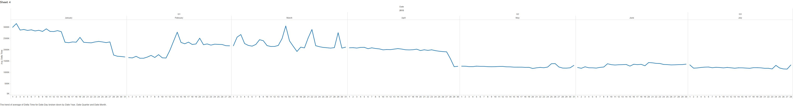
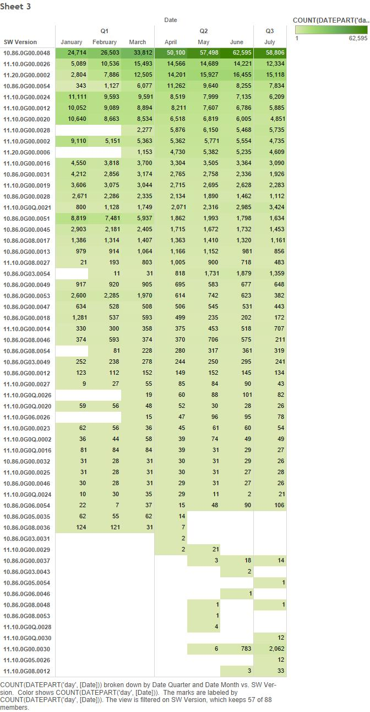

# NetApp

Brian McKean, a senior engineer at NetApp, gave a talk about his company in class.
He shared a data problem for our class to help solve.

# Tool
Tableau

# Authors

This report is prepared by
* [Kari Santos](https://github.com/karisantos)
* [Heather Witte](https://github.com/hswitte)
* [Zachary Lamb](https://github.com/ZachLamb)
* [Fadhil Suhendi](https://github.com/fadhilfath)
* [Denis Kazakov](https://github.com/94kazakov)

# (Question)

(answer)

# (Question)

(answer)

# (Question)

From the dataset, can we pinpoint when the so called software fix for the Base Time attribute was implemented?

# (Question)

(answer)

# (Question)

(answer)

# Further Analysis

Our team determines the following questions are too complex for Tableau and
require custom scripts to be written.

* (Question)
* (Question)
* (Question)
* (Question)
